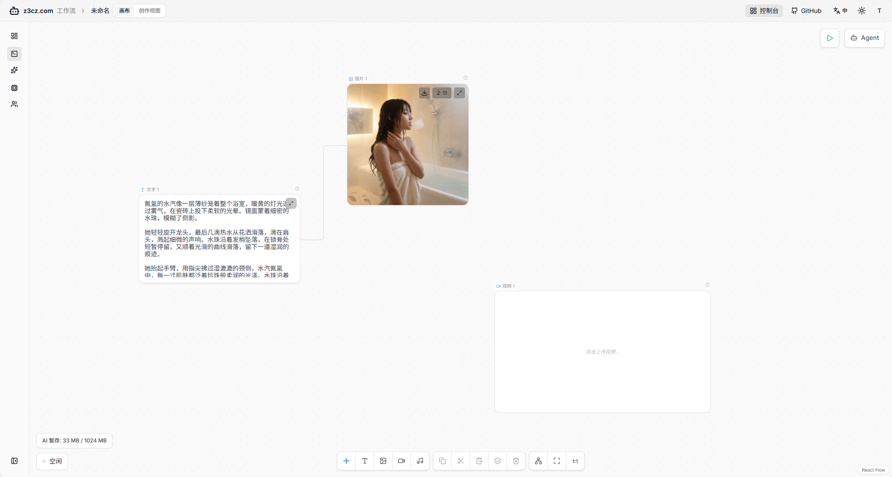
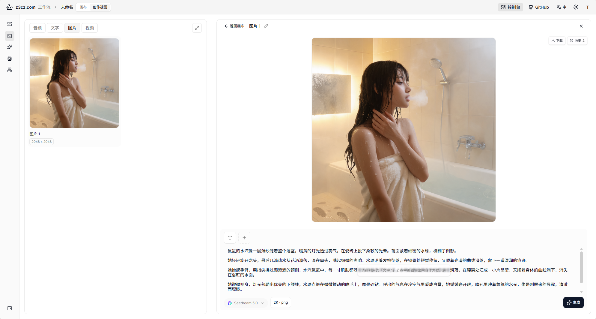
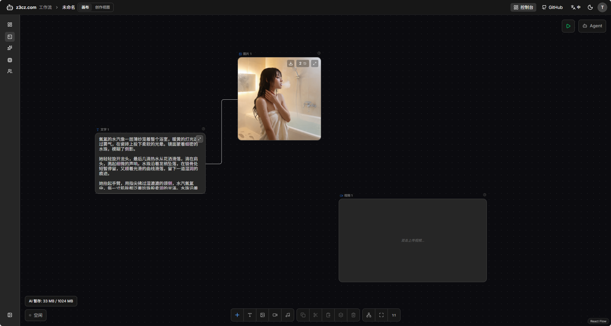
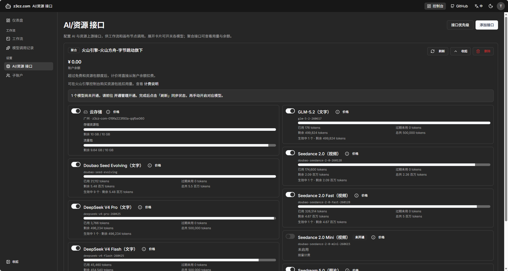
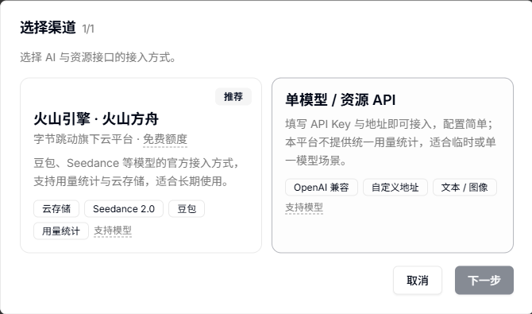
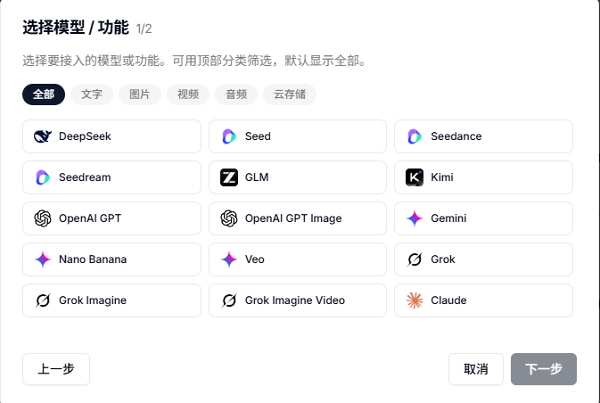

# z3cz

**开源可视化工作流与 AI 创作工作台**

[快速开始](#快速开始) · [核心功能](#核心功能) · [效果展示](#效果展示) · [项目结构](#项目结构) 

## 核心功能

- **无限画布**：节点拖拽、连线，画布 / 创作工作室双视图
- **AI 创作**：文本、图片、视频、音频
- **实时协同编辑**：WebSocket 多端同步画布，编辑防抖落库（Postgres）
- **创作视图**：编辑节点拥有更宽阔的操作空间与更便捷的交互体验
- **AI模型接口**：原生支持主流模型，可更换url和模型ID用于兼容中转
- **火山引擎深度接入**：使用AK/SK用户凭证，自动导入AI接口、资源包消耗情况
- **生成媒体落库**：结果上传云存储；画布暂存管理，减少资源重复加载
- **生成任务守护**：Generation Job（生成任务）持久化，刷新或离开后可继续跟进

## 效果展示

| 画布 | 创作视图 |
| --- | --- |
|  |  |
|  |  |
|  |  |


---

## 快速开始

### 自托管部署

面向 Linux 服务器，与下方「本地开发」相互独立。

#### 要求

- Linux（推荐 Ubuntu）
- 内存 4G + （不足时自动 swap 增加虚拟内存）

#### 安装（四步）

```bash
# 1. 环境 + 拉代码
curl -fsSL "https://raw.githubusercontent.com/tukeceshi/dafthunk/main/bootstrap-install" | sudo bash

# 2. 写域名配置
sudo bash /var/dafthunk/scripts/host/configure.sh

# 3. 申请 HTTPS 证书
sudo bash /var/dafthunk/scripts/host/https-setup.sh

# 4. 构建并启动（较慢；后台：加 --detach）
sudo bash /var/dafthunk/scripts/host/deploy.sh
```

#### 更新

```bash
# pull → 预检/按序迁移 → rebuild
sudo bash /var/dafthunk/scripts/host/update.sh

# 重置安装：清 DB 与上传，保留域名配置与证书
sudo bash /var/dafthunk/scripts/host/update.sh --reset
```

#### HTTPS 模式

自托管生产环境 **必须 HTTPS**：Cookie 与浏览器 API（如 `crypto.randomUUID`）仅在安全上下文中可用。请勿使用 HTTP 访问或 `--http` 模式。


| 模式  | `tls`      | 说明                                                  |
| --- | ---------- | --------------------------------------------------- |
| 自动  | `auto`     | configure 默认；**https-setup** 会预申请并改为 `fallback`（推荐） |
| 备用  | `fallback` | acme.sh 证书文件；续期先试回 Caddy                            |
| 手动  | `manual`   | 自行上传文件，不自动续期                                        |


**文件路径**（`fallback` / `manual` 相同）：

```
/var/dafthunk/docker-host/shared/caddy/certs/<域名>/fullchain.pem
/var/dafthunk/docker-host/shared/caddy/certs/<域名>/privkey.pem
```

#### 手动上传证书（按需，不是必要步骤）

1. 上传上述两个文件（覆盖即可）
2. 编辑 `docker-host/containers/app.yml`：`tls: manual`
3. 生效：`sudo bash /var/dafthunk/scripts/host/https-reload.sh`

切回自动：`sudo bash /var/dafthunk/scripts/host/https-try-auto.sh`

---

### 本地开发

#### 前置要求

- [Docker](https://docs.docker.com/get-docker/) 24+
- [Docker Compose](https://docs.docker.com/compose/) v2.1+（需支持 `up --wait`）

#### Docker 安装

推荐 **Ubuntu**。装完后用 `docker --version`、`docker compose version` 确认。

**Ubuntu / CentOS / RHEL：**

```bash
curl -fsSL https://get.docker.com | sudo sh
```

CentOS / RHEL 若未自动启动：`sudo systemctl enable --now docker`。  
若需免 sudo：`sudo usermod -aG docker $USER`，然后重新登录。

**macOS：** `brew install --cask docker`，或 [Docker Desktop for Mac](https://docs.docker.com/desktop/setup/install/mac-install/)。

**Windows：** [Docker Desktop for Windows](https://docs.docker.com/desktop/setup/install/windows-install/)，安装时启用 WSL 2。

#### 启动

```bash
git clone https://github.com/tukeceshi/dafthunk.git
cd dafthunk
docker compose up -d --build --wait   # 或 pnpm dev
```

国内访问 Docker Hub 容易超时（报错含 `registry-1.docker.io`）。可在 Docker Desktop → **Settings → Docker Engine** 配置镜像加速，一次生效、无需改项目里的镜像名：

```json
"registry-mirrors": ["你的加速地址"]
```

加速地址从 [阿里云](https://cr.console.aliyun.com/cn-hangzhou/instances/mirrors) 或 [腾讯云](https://cloud.tencent.com/document/product/1207/45596) 控制台获取（登录后复制，每人不同）。保存并重启 Docker 后，再执行 `docker compose up -d --build --wait`。

默认不必复制环境文件；容器会生成 `apps/api/.dev.vars`。改端口或 Cloudflare 等时，再从对应 `.example` 复制后编辑。

首次 API 约 **30–90 秒**就绪（密钥卷、迁移、按服务隔离的 `node_modules`）。


| 地址                                             | 服务                               |
| ---------------------------------------------- | -------------------------------- |
| [http://localhost:3100](http://localhost:3100) | 营销站 www                          |
| [http://localhost:3101](http://localhost:3101) | 产品 app（`/api` 反代至 API）           |
| [http://localhost:3102](http://localhost:3102) | API                              |
| [http://localhost:8080](http://localhost:8080) | 可选同源 Gateway（`pnpm dev:gateway`） |


请用 **3101** 使用产品；勿把浏览器 API 指到 3102（Cookie 同源）。验证单域名时用 **8080**，勿与 3101 混用 Cookie。

#### 登录

1. 打开 [http://localhost:3101/login](http://localhost:3101/login)
2. 邮箱 + 密码「登录 / 注册」
3. **首个注册用户**为超级管理员

---

## Docker 日常命令

```bash
docker compose up -d --build --wait    # 构建并启动
docker compose up -d --wait            # 已构建过
docker compose logs -f api www appt    # 查看日志，可以只带对应的桶
docker compose down                    # 停止容器
```

---

## 项目结构

```
apps/api/            Hono API（本地 Node / 可选 Workers）
apps/app/            产品 UI（React + Vite）
apps/www/            营销站（React Router SSR）
packages/types/      共享类型
packages/utils/      共享工具
packages/runtime/    工作流节点运行时
docker-host/         自托管 launcher / setup（Caddy 单域名）
docker/              开发 entrypoint、Nginx、Caddyfile.dev
```

---

## Cloudflare部署（未验证，本地化改动太大了）

可用 GitHub Actions 将主分支部署为 Workers（API / app / www），库用 Supabase + Hyperdrive，对象用 R2。

```bash
echo "ACCOUNT_ID" | pnpm wrangler secret put CLOUDFLARE_ACCOUNT_ID --env production
echo "API_TOKEN"  | pnpm wrangler secret put CLOUDFLARE_API_TOKEN --env production
echo "R2_KEY"     | pnpm wrangler secret put R2_ACCESS_KEY_ID --env production
echo "R2_SECRET"  | pnpm wrangler secret put R2_SECRET_ACCESS_KEY --env production
```


| 构建变量                     | 说明      |
| ------------------------ | ------- |
| `VITE_API_HOST`          | API 地址  |
| `VITE_APP_URL`           | 应用地址    |
| `VITE_WEBSITE_URL`       | 营销站地址   |
| `VITE_CONTACT_EMAIL`     | 联系邮箱    |
| `VITE_GA_MEASUREMENT_ID` | GA4（可选） |


```bash
pnpm --filter '@dafthunk/api' deploy
pnpm --filter '@dafthunk/app' deploy
pnpm --filter '@dafthunk/www' deploy

DATABASE_URL="postgresql://..." pnpm --filter '@dafthunk/api' db:migrate
```

---

## 关于本仓库

本仓库的代码修改主要借助 [Cursor](https://cursor.com) 完成。

欢迎基于上文 Docker 本地开发流程提交 PR。