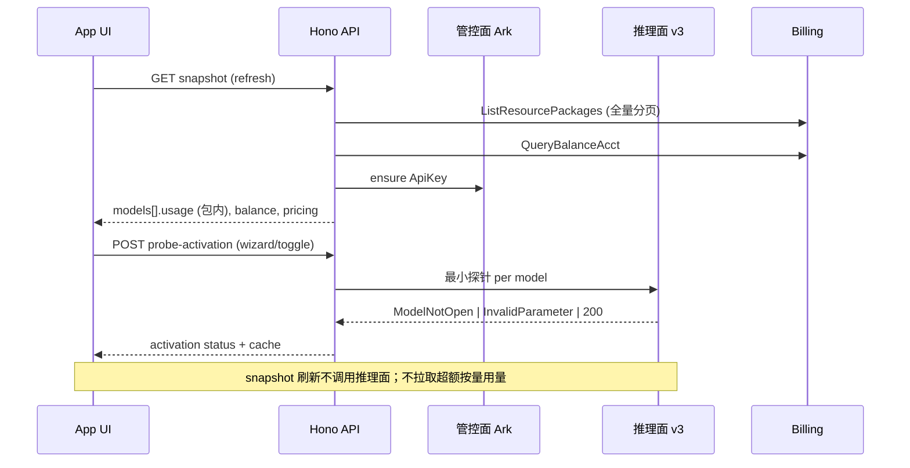

# 火山方舟 AI 接口改造总方案

> 整理日期：2026-07-11  
> 状态：**Phase A–D 已实现**（2026-07-11 开工）  
> 本文档为总览；细节见文末「关联文档」。

---

## 1. 背景与目标

在 Dafthunk 组织级「火山方舟」AI 接口中，用户通过 AK/SK 绑定账户，平台代为签发 Ark API Key，展示 **8 个 catalog 模型**的启用、用量与定价信息。

本次改造目标：

1. **凭证与用量链路可靠**（签名、API Key、单次用量查询）
2. **按模型展示用量**（文字 / 图片 / 视频），免费与按量可区分
3. **模型开通可感知**（控制台未开通时给出明确提示）
4. **UI 信息密度与准确性提升**（v3 交互，进度条语义修正）

---

## 2. 现状总览

### 2.1 已完成（代码在库）

| 模块 | 内容 |
|------|------|
| **凭证** | AK/SK 签名（SK 不 base64 解码）；`GetApiKey` / `ListApiKeys` / `GetRawApiKey`（numeric Id） |
| **用量** | 单次 `GetInferenceUsage`（29 天窗口，`yyyy-MM-dd` + `QueryInterval: Day`） |
| **聚合** | 按 `ModelName` + `BillingStatus` 汇总；free = `free_for_free_quota` \| `free_for_limit_boundary` |
| **类型** | `VolcanoSnapshotResponse`、`VolcanoModelUsage`、pricing catalog |
| **Snapshot** | API Key 状态、余额、pricing、每模型 `usage` |
| **前端 v1** | 模型列表、`VolcanoUsageMeter`（已用 %）、`VolcanoPricingFooter`、三步向导 |
| **测试** | `volcengine-parsers.test.ts`（10 项）；多份 `probe-volcano-*.ts` 脚本 |

### 2.2 未完成（方案已定）

| 模块 | 内容 |
|------|------|
| **开通检测** | 推理最小探针 + `probe-activation` API + 向导/Toggle 集成 |
| **UI v3** | 剩余额度进度条、masonry 双列、定价 Popover、资源包提示上移、AK/SK 防自动填充 |
| **用量 v3** | 有顶进度条 vs 按量纯文本；Token 包仅文本（无 API 总容量） |

---

## 3. 架构原则

```
┌─────────────────────────────────────────────────────────────┐
│  管控面 ark.cn-beijing.volcengineapi.com  (IAM AK/SK 签名)   │
│  · GetInferenceUsage  → 用量（单次/刷新）                    │
│  · ListApiKeys / GetApiKey  → 签发 Ark API Key               │
│  · ListFoundationModels*  → 元数据（非开通状态）              │
└─────────────────────────────────────────────────────────────┘
                              │
┌─────────────────────────────────────────────────────────────┐
│  推理面 ark.cn-beijing.volces.com/api/v3  (Bearer API Key)  │
│  · chat / images / video tasks  → 模型开通最小探针           │
└─────────────────────────────────────────────────────────────┘
```

| 原则 | 说明 |
|------|------|
| 用量与开通 **解耦** | `GetInferenceUsage` 不做开通判断；开通探针不参与 snapshot 刷新 |
| 单次用量拉取 | 不对每模型或每 BillingStatus 并行多次 `GetInferenceUsage` |
| ModelId 唯一 | 推理与用量行匹配用 `providerModelId`；管控面用 `FoundationModelName` |
| 静态定价/免费上限 | 来自 [定价文档](https://docs.volcengine.com/docs/82379/1544106)；月度 free quota 无下发 API |

---

## 4. Catalog 与 ID 映射（已验证）

8 个模型见 `packages/types/src/ai-model-catalog.ts`。

| 概念 | 示例 | 用途 |
|------|------|------|
| `canonicalId` | `deepseek-v4-pro` | 平台内部键、metadata |
| `providerModelId` / **ModelId** | `deepseek-v4-pro-260425` | 推理调用、用量行匹配、开通探针 |
| **FoundationModelName** | `deepseek-v4-pro` | `GetFoundationModel`、`ListFoundationModelVersions` |

完整映射表见 [volcano-ark-api-verification.md §4.1](./volcano-ark-api-verification.md)。

---

## 5. 分阶段实施计划

### Phase A — 用量与 Snapshot（✅ 已完成）

- [x] 修复 Volcano 签名与 API Key 流程
- [x] `GetInferenceUsage` 请求格式与解析
- [x] 单调用 snapshot + 按模型 `usage` + pricing footer
- [x] 前端模型行 + 用量条 + i18n

**待有用量账号复验**：`Rows` 是否含 `ModelName` / `BillingStatus` 及取值格式。

---

### Phase B — 模型开通检测（📋 方案已定，未实现）

**结论（已验证）**：

- ❌ 管控面无开通查询 API  
- ❌ `GetInferenceUsage` 无法区分已开通/未开通（全返回 `DataCount=0`）  
- ✅ **推理 API 最小探针**为唯一可靠手段  

#### B.1 最小探针（脚本已验证，生产未实现）

| 模态 | 端点 | 请求要点 | 已开通 | 未开通 |
|------|------|----------|--------|--------|
| text | `POST /chat/completions` | `max_tokens: 1` | 200 | 404 `ModelNotOpen` |
| image | `POST /images/generations` | `size: "1x1"` | 400 `InvalidParameter` | 404 `ModelNotOpen` |
| video | `POST /contents/generations/tasks` | `duration: 0` | 400 `InvalidParameter` | 404 `ModelNotOpen` |

> image/video 必须用 **非法参数** 路径，避免 200 出图/建 `cgt-*` 任务。

#### B.2 错误码判定

| `error.code` | 状态 | UI |
|--------------|------|-----|
| `ModelNotOpen` | 未开通 | 琥珀徽章 + [开通管理](https://console.volcengine.com/ark/region:cn-beijing/openManagement) |
| `OperationDenied.ServiceNotOpen` | 服务未激活 | 同上（待实机复现） |
| `InvalidEndpointOrModel.NotFound` | ModelId 配置错误 | 红色，内部问题 |
| `InvalidParameter` / 2xx | 已开通 | 无警告 |
| `AuthenticationError` | 凭证无效 | 接口级错误 |

#### B.3 拟实现清单

| 项 | 路径/说明 |
|----|-----------|
| 探针模块 | `apps/api/src/integrations/volcengine/probe-model-activation.ts` |
| 路由 | `POST /organizations/:orgId/ai-interfaces/:id/probe-activation` |
| 触发 | 向导勾选后批量；Toggle 启用时单个；手动「检测开通」 |
| 不触发 | Snapshot 刷新 |
| 缓存 | metadata `modelActivationCache`，TTL 24h |
| 并发 | ≤3 |
| 测试 | Vitest `classifyInferenceProbe`；E2E 向导/Toggle |

详见 [volcano-model-activation-probe-plan.md](./volcano-model-activation-probe-plan.md)。

---

### Phase C — 用量展示 v4（📋 见 [volcano-resource-packages-migration-plan.md](./volcano-resource-packages-migration-plan.md) §6）

数据源从 `GetInferenceUsage` 切换为 **`billing/ListResourcePackages`**（全量分页 + `ConfigurationCode` 匹配）。

#### C.1 进度条 = 包内剩余额度（有包才显示）

| 场景 | 进度条 | 文案 |
|------|--------|------|
| **有资源包/免费包** | `remaining / quota`（`AvailableAmount` / `TotalAmount`） | 剩余 + 单位；可选包内 `used/quota` |
| **包用尽** | 0% | 「额度已用尽」；**不**展示超额按量用量 |
| **无包、已开通** | 无 | 「按量计费」+ 定价 Popover（无实时用量数字） |

**删除**：`paidUsed`、`meteredUsage`、`VolcanoUsageBreakdown` 按量拆分、`GetInferenceUsage` 于 Snapshot。

#### C.2 账户余额

- API：`billing/QueryBalanceAcct` → `snapshot.balance`（`query-balance.ts` 待实现）
- UI：面板顶、计费说明前展示 `available`（CNY）

#### C.3 计费扣款提示

面板顶、定价文档链接 **之前** 固定文案：

> 超过免费和资源包额度后，计价将直接从账户余额扣费。

#### C.4 模态标签

模型名旁括号仅：**文字** / **图片** / **视频**（`modalityShort`）。

#### C.5 视频计费说明

Popover/定价中保留 token 阶梯说明（来自 pricing catalog `pricingNotes`）。

---

### Phase D — 面板 UI v3（📋 方案已定，未实现）

| 项 | 变更 |
|----|------|
| 布局 | 模型卡片 **双列 masonry** |
| 定价 | 每模型 **Popover** 展示价格；**移除** `VolcanoPricingFooter` 整表 |
| 计费提示 | 接口标题下：**超额扣余额** 说明（§C.3） |
| 余额 | 接口标题下：**账户余额**（§C.2） |
| 资源包 | 购买引导 + 定价文档链接 |
| API Key | 临时 Key 状态行降级或合并 |
| 开通 | 模型行显示 Phase B 探测结果徽章 |
| 向导 | 保存前可选批量开通检测 + 警告 |
| AK/SK | `autoComplete="off"`、`new-password`、decoy 字段等防浏览器填充 |

---

## 6. 数据流（目标态）



---

## 7. 文件索引

### 7.1 后端（已有）

```
apps/api/src/integrations/volcengine/
  client.ts, signature.ts, constants.ts
  get-api-key.ts, ensure-api-key.ts
  get-inference-usage.ts, parse-inference-usage.ts, aggregate-volcano-usage.ts
  snapshot.ts, query-balance.ts, metadata.ts
```

### 7.2 后端（拟新增）

```
  probe-model-activation.ts
apps/api/src/routes/ai-interfaces.ts  → probe-activation 路由
```

### 7.3 类型

```
packages/types/src/
  ai-model-catalog.ts
  volcano-snapshot.ts
  volcano-pricing-catalog.ts
```

### 7.4 前端（已有 → 拟改）

```
apps/app/src/pages/organization-ai-interfaces/
  volcano-interface-panel.tsx      # masonry、资源包提示上移
  volcano-model-row.tsx            # 开通徽章、Popover 定价
  volcano-usage-meter.tsx          # 包内剩余进度条；无 meteredUsage
  volcano-pricing-footer.tsx     # 拟删除
  volcano-wizard-dialog.tsx        # 开通探测、AK/SK 防填充
```

### 7.5 探测脚本（验证用，非生产）

```
apps/api/scripts/
  probe-volcano-api-verify*.ts
  probe-volcano-model-activation.ts
  probe-volcano-activation-minimal.ts   # 最小探针复现
  probe-volcano-usage-activation*.ts    # 用量≠开通 否定验证
```

---

## 8. 测试策略

| 层级 | 内容 | 状态 |
|------|------|------|
| 单元 | usage 解析/聚合 | ✅ |
| 单元 | `classifyInferenceProbe` | 待 Phase B |
| 集成脚本 | AK/SK 全链路 probe | ✅ |
| E2E | 向导 + 面板 + 开通警告 | 待 B+D |
| 复验 | 有用量账号 `GetInferenceUsage` Rows 形态 | 待外部账号 |

复现：

```bash
export VOLC_AK=... VOLC_SK=...
pnpm --filter @dafthunk/api exec tsx scripts/probe-volcano-activation-minimal.ts
```

---

## 9. 风险与未决项

| 项 | 影响 | 处理 |
|----|------|------|
| 用量结算延迟 | ListResourcePackages 与控制台可能不同步 | 正常；刷新 Snapshot 即可 |
| 超额按量无 API | 不展示超额 token/张数 | 余额 + 计费提示说明扣费方式 |
| Token 包总容量 | `TotalAmount` / `AvailableAmount` 来自 billing | 进度条可画 |
| 测试 AK/SK 泄露 | 安全 | 控制台轮换 |
| 向导是否阻止保存未开通模型 | 产品 | 建议警告可保存，Toggle 启用时阻止 |

---

## 10. 建议实施顺序

```
Phase B（开通检测后端 + API）
    ↓
Phase B 前端（向导/Toggle 徽章）
    ↓
Phase C（用量条语义）
    ↓
Phase D（masonry、Popover、文案位置、AK/SK）
```

Phase C 与 D 可部分并行；均依赖 Phase A（已完成）。

---

## 11. 关联文档

| 文档 | 内容 |
|------|------|
| [volcano-ark-api-verification.md](./volcano-ark-api-verification.md) | 管控面 API 验证、GetInferenceUsage、ID 映射、v3 修订要点 |
| [volcano-resource-packages-migration-plan.md](./volcano-resource-packages-migration-plan.md) | ListResourcePackages、包内用量、余额、计费提示 |
| [volcano-model-activation-probe-plan.md](./volcano-model-activation-probe-plan.md) | 开通探测 v2：用量否定、最小探针、错误码、拟 API |

---

## 12. 变更记录

| 日期 | 说明 |
|------|------|
| 2026-07-11 | 用量 v4：包内 only、余额、超额扣余额提示；迁移至 billing API |
